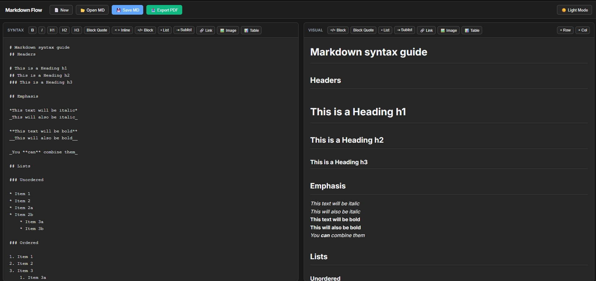

# Markdown Flow 

## 🎯 Purpose of the Project
Markdown Flow is a modern, entirely in-browser Markdown workspace designed to make writing and formatting Markdown completely effortless. Its primary purpose is to provide seamless, **two-way live synchronization** between a raw Markdown text editor and a visual WYSIWYG (What You See Is What You Get) preview panel. 

Because it requires absolutely no backend server, everything runs securely and quickly right in your browser. This makes it perfect for offline use, fast local editing, and exporting clean, beautifully formatted PDFs on the fly.

---

##  Live Demo

You can try out MarkFlow directly in your browser without downloading anything!
**[Click here to view the Live Demo](https://abyshergill.github.io/markdown_flow/)** 



## How to Clone and Run Locally
Since MarkFlow has zero backend dependencies, setting it up is incredibly simple.

1. **Clone the repository:**
   ```bash
   git clone https://github.com/abyshergill/markdown_flow.git
   ```

2. **Navigate to the project directory:**
   ```bash
   cd markdown_flow.git
   ```


3. **Launch the app:**
Simply double-click the `index.html` file to open it in your default web browser.

---

## ✨ Key Features

* **Two-Way Live Sync:** Type in Markdown, see it visually. Edit visually, and watch the Markdown update automatically!
* **Smart Formatting Toggles:** Highlight text to easily toggle headings, bold/italics, code blocks, lists, and quotes.
* **Dark & Light Mode:** Sleek, modern interface that supports both dark and light themes natively.
* **Smart PDF Export:** Convert your markdown into a perfectly formatted, printable PDF (the app auto-adjusts for Light mode during export for perfect printing).
* **Smart HTML Export:** Convert your markdown into a perfectly formatted HTML files.
* **Offline Capable:** Once loaded, it runs entirely on client-side JavaScript.

## How to Use Markdown

Markdown is a lightweight markup language that you can use to add formatting elements to plaintext documents. Here are the basics supported in MarkFlow:

* **Headings:** Use `#` for H1, `##` for H2, `###` for H3, etc.
* **Bold:** `bold text`
* **Italic:** `*italic text*`
* **Lists:** Use `- ` or `* ` for bulleted lists. To create a sublist, indent with 4 spaces `    - sub-item`.
* **Links:** `[Link Text](https://example.com)`
* **Images:** `` *(Note: MarkFlow safely renders images as placeholder boxes to keep the environment fast and secure).*
* **Blockquotes:** `> This is a quote`
* **Code Blocks:** Wrap text in triple backticks (```) for multi-line code.
* **Inline Code:** Wrap text in single backticks (`) for `inline code`.
* **Tables:** 
   ```markdown
   | Header 1 | Header 2 |
   | --- | --- |
   | Data 1 | Data 2 |
   ```
## 🙏 Special Thanks & Built With

This project wouldn't be possible without the incredible open-source libraries that power the core parsing and conversion features. A huge thank you to the creators of the following tools used via CDN:

* **[Marked.js (v4.3.0)](https://cdn.jsdelivr.net/npm/marked%404.3.0/marked.min.js):** For fast, robust Markdown-to-HTML parsing.
* **[Turndown.js (v7.1.2)](https://unpkg.com/turndown%407.1.2/dist/turndown.js):** For the magic of converting HTML back into clean Markdown.
* **[Turndown GFM Plugin (v1.0.2)](https://unpkg.com/turndown-plugin-gfm%401.0.2/dist/turndown-plugin-gfm.js):** For adding GitHub Flavored Markdown support, notably tables.
* **[html2pdf.js (v0.10.1)](https://cdnjs.cloudflare.com/ajax/libs/html2pdf.js/0.10.1/html2pdf.bundle.min.js):** For rendering the visual HTML view into downloadable PDF documents entirely on the client side.

## 📄 License <p align="center">
  <a href="LICENSE"></a>
</p>

This project is licensed under the **MIT License** - meaning it is completely free to use, modify, distribute, and build upon.
